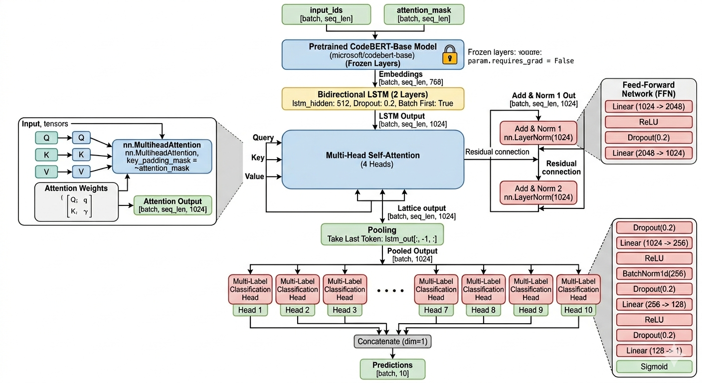

# Multi-Label Semantic-Aware Network (BBLA)

## Overview

**Multi-Label Semantic-Aware Network** is a deep learning model designed for multi-label text classification tasks. The model leverages **CodeBERT**, **Bi-LSTM**, and **Multi-Head Attention** mechanisms to effectively capture semantic relationships and contextual dependencies in text data.

### What is Multi-Label Classification?

Unlike traditional single-label classification where each sample belongs to exactly one category, multi-label classification allows a sample to be assigned to multiple categories simultaneously. For example, a question can be tagged with multiple technology topics (e.g., "python", "machine-learning", "deep-learning").

### Dataset Characteristics

The dataset consists of:
- **Text Input**: Combination of title and question text
- **Multiple Labels**: Each sample can have zero or more associated tags/labels
- **Format**: Parquet files for efficient data storage and retrieval
- **Split**: Training, validation, and test sets for robust model evaluation
- **Multi-hot Encoding**: Labels are encoded as binary vectors where 1 indicates the presence of a label and 0 indicates absence

---

## Architecture

The model employs a sophisticated pipeline combining multiple neural network components:

### Model Architecture Diagram



### Architecture Components

The BBLA (BERT-Bi-LSTM-Attention) architecture consists of the following layers:

#### 1. **CodeBERT Encoder** (Input Layer)
- **Model**: Microsoft's CodeBERT pre-trained model
- **Purpose**: Converts raw text into dense semantic embeddings
- **Output Dimension**: 768 (hidden size)
- **Training**: Frozen to preserve pre-trained knowledge and reduce memory consumption
- **Input**: Tokenized text sequences (max length: 512 tokens)

#### 2. **Bidirectional LSTM (Bi-LSTM)** (Sequence Processing Layer)
- **Architecture**: 2-layer LSTM with bidirectional processing
- **Hidden Size**: 512 per direction (1024 total output)
- **Purpose**: Captures long-range dependencies and contextual relationships in both forward and backward directions
- **Dropout**: 0.2 (prevents overfitting)
- **Input**: CodeBERT embeddings [batch_size, seq_len, 768]
- **Output**: [batch_size, seq_len, 1024]

#### 3. **Multi-Head Self-Attention** (Attention Layer)

The multi-head self-attention mechanism uses **4 attention heads**, where each head independently learns different types of relationships and dependencies in the sequence. This allows the model to simultaneously capture multiple aspects of semantic importance.

##### Multi-Head Attention Architecture:

- **Total Embedding Dimension**: 1024 (matches Bi-LSTM output)
- **Number of Heads**: 4
- **Dimension per Head**: 1024 ÷ 4 = **256 dimensions per head**

##### What Each of the 4 Attention Heads Learns:

The model does not explicitly assign semantic roles to each head—instead, during training, the 4 heads learn to specialize in different aspects of the input:

**Head 1: Syntactic/Structural Dependencies**
- Learns to attend to grammatical structures and word order
- Captures relationships between parts of speech (noun-verb, adjective-noun)
- Identifies phrase boundaries and sentence structure
- Example: Links tokens within technical function calls or method signatures

**Head 2: Semantic Entity Relationships**
- Focuses on meaningful relationships between key terms and concepts
- Identifies domain-specific entities and their interactions
- Captures thematic coherence across the sequence
- Example: Relates programming language names to library/framework names

**Head 3: Long-Range Dependencies**
- Attends to tokens that are distant from each other
- Captures topic continuity and main concepts
- Learns global context and overall meaning
- Example: Connects the main problem statement at the beginning to relevant details later

**Head 4: Label-Relevant Features**
- Specializes in identifying tokens most relevant to label prediction
- Learns which keywords and phrases are indicative of specific tags
- Focuses on problem domain indicators and technology mentions
- Example: Highlights presence of specific keywords like "database", "API", "debugging"

##### Multi-Head Attention Mechanism:

For each head `h` (h = 1, 2, 3, 4):

1. **Linear Projections** (learned during training):
   - Query: Q_h = BiLSTM_output × W^Q_h
   - Key: K_h = BiLSTM_output × W^K_h
   - Value: V_h = BiLSTM_output × W^V_h
   - Each projects 1024-dim to 256-dim per head

2. **Attention Scores**:
   - Attention_scores_h = softmax((Q_h × K_h^T) / √256)
   - Shape: [batch_size, seq_len, seq_len]
   - Represents which tokens to focus on

3. **Attention Output**:
   - head_output_h = Attention_scores_h × V_h
   - Shape: [batch_size, seq_len, 256]

4. **Concatenation and Projection**:
   - All 4 heads concatenated: [head_1_output; head_2_output; head_3_output; head_4_output]
   - Shape: [batch_size, seq_len, 1024]
   - Final projection: MultiHeadAttention_output = Concatenated_output × W^O

##### Why 4 Heads?

- **Computational Efficiency**: 4 heads provide a good balance between model capacity and computational cost
- **Diverse Representation**: Multiple heads capture different linguistic phenomena simultaneously
- **Robustness**: If one head learns a spurious pattern, other heads provide different perspectives
- **Complementary Features**: Each head specializes in different aspects, reducing the redundancy in the final representation
- **Information Aggregation**: The parallel processing allows the model to weigh multiple interpretations of the input

##### Attention Head Visualization Example:

```
Input Sequence: "Python library for machine learning tasks"

Head 1 (Syntactic):
  "Python" → attends to nearby tokens [library, for]
  "learning" → attends to [machine, tasks]
  
Head 2 (Semantic):
  "Python" → attends to [library, machine]
  "learning" → attends to [library, tasks]
  
Head 3 (Long-Range):
  "Python" → attends to [learning, tasks]
  "for" → attends to [machine]
  
Head 4 (Label-Relevant):
  "Python" → high attention (keyword for tags)
  "machine" → high attention (keyword for tags)
  "learning" → high attention (keyword for tags)
```

##### Key Padding Mask:

- Padding tokens (position 511-512 if text is shorter) have attention masked to 0
- Prevents the model from learning spurious correlations with padding
- Only attends to real input tokens

**Output**: [batch_size, seq_len, 1024] - Re-weighted sequence with learned importance

#### 4. **Layer Normalization & Feed-Forward Network**
- **Normalization**: Layer normalization with residual connections (Add & Norm)
- **Feed-Forward**: A 2-layer fully connected network
  - Dense: 1024 → 2048
  - Activation: ReLU
  - Dropout: 0.2
  - Dense: 2048 → 1024
- **Purpose**: Adds non-linearity and further refines feature representations

#### 5. **Classification Heads** (Output Layer)
- **Number of Heads**: 10 (one for each label)
- **Each Head Architecture**:
  - Dropout (0.2)
  - Dense: 1024 → 256
  - ReLU activation
  - Batch Normalization
  - Dropout (0.2)
  - Dense: 256 → 128
  - ReLU activation
  - Dropout (0.2)
  - Dense: 128 → 1
  - **Sigmoid activation** (outputs probability between 0 and 1)
- **Purpose**: Independent binary classification for each label, enabling true multi-label predictions
- **Output**: [batch_size, 10] - probability scores for each label

---

## How It Works

### Data Flow Pipeline

```
Raw Text (Title + Question)
    ↓
[Tokenization & Padding] (max_length=512)
    ↓
[CodeBERT] → 768-dim embeddings
    ↓
[Bi-LSTM 2-layer] → Captures bidirectional context
    ↓
[Multi-Head Attention (4 heads)] → Learns diverse feature importance
    ↓
[Layer Norm + Feed-Forward] → Refines representations
    ↓
[Last Token Pooling] → Selects sequence representation
    ↓
[10 Classification Heads] → Independent label predictions
    ↓
[Sigmoid] → Probability scores (0-1)
    ↓
[Threshold (0.5)] → Binary predictions
```

### Step-by-Step Inference Process

1. **Tokenization**: Input text is tokenized using CodeBERT's tokenizer, converted to token IDs, and padded/truncated to 512 tokens
2. **Embedding Generation**: CodeBERT processes tokenized input (frozen) to produce semantic embeddings
3. **Sequential Processing**: Bi-LSTM processes embeddings bidirectionally, capturing long-range dependencies
4. **Multi-Head Attention**: 4 attention heads independently learn and apply different weighting schemes to identify important tokens
5. **Feature Refinement**: Layer normalization and feed-forward network further transform features
6. **Pooling**: Last token's representation is selected as the sequence-level representation
7. **Label Predictions**: Each of 10 independent classification heads processes the pooled representation
8. **Probability Output**: Sigmoid activation produces probability for each label (0-1)
9. **Binary Classification**: Probabilities above 0.5 threshold are converted to binary labels

### Training Process

- **Loss Function**: Binary Cross-Entropy (BCELoss) for multi-label classification
- **Optimizer**: AdamW with learning rate 1e-4 and weight decay 1e-5
- **Batch Size**: 32 for training, 64 for validation/testing
- **Gradient Clipping**: max_norm=1.0 to prevent exploding gradients
- **Evaluation Metrics**: 
  - Macro F1 (average F1 across all labels)
  - Micro F1 (aggregate TP/FP/FN across all labels)
  - Exact Match Ratio
  - Subset Accuracy
  - Precision and Recall

---

## Project Architecture Description

### File Structure

```
Multi-Label-Semantic-Aware-Network/
├── README.md                    # Project documentation
├── requirements.txt             # Python package dependencies
├── image_1.png                  # Model architecture diagram
│
├── config.py                    # Configuration and hyperparameters
├── models.py                    # Model architecture definition
├── data_loader.py              # Data loading and preprocessing
├── trainer.py                   # Training and evaluation logic
├── main.py                      # Main training script
├── predict.py                   # Prediction and inference script
└── bblamultilabelmodel.ipynb   # Jupyter notebook demonstration
```

### File Descriptions

#### **config.py**
- **Purpose**: Centralized configuration management for the entire project
- **Key Components**:
  - `build_label_mappings()`: Extracts unique labels from dataset and creates mappings (label→index, index→label)
  - `save_label_mappings_txt()`: Persists label mappings to disk for inference time
  - `Config` class: Contains all hyperparameters including:
    - Data paths (train/val/test parquet files)
    - Model hyperparameters (hidden sizes, dropout, attention heads)
    - Training parameters (batch sizes, learning rate, epochs)
    - Device configuration (CUDA/CPU)
    - Prediction threshold (0.5)
    - Maximum sequence length (512 tokens)

#### **models.py**
- **Purpose**: Defines the core neural network architecture
- **Key Class**: `BBLAMultiLabelModel(nn.Module)`
  - Implements the complete BERT→BiLSTM→Attention→Classification pipeline
  - `__init__()`: Initializes all layers (CodeBERT, Bi-LSTM, Attention, Heads)
  - `forward()`: Defines the forward pass through all components
  - Returns probability predictions for all labels

#### **data_loader.py**
- **Purpose**: Handles data loading and preprocessing
- **Key Components**:
  - `MultiLabelDataset`: Custom PyTorch Dataset class
    - Loads parquet files with text and tags
    - Tokenizes text using CodeBERT tokenizer
    - Creates multi-hot encoded label vectors
    - Returns dictionaries with `input_ids`, `attention_mask`, and `labels`
  - `create_data_loaders()`: Factory function that creates train/val/test DataLoaders
    - Handles tokenization and batching
    - Configurable batch sizes for different phases

#### **trainer.py**
- **Purpose**: Implements training and evaluation logic
- **Key Components**:
  - `Trainer` class: Manages model training lifecycle
    - `train_epoch()`: Single training epoch with gradient updates and loss calculation
    - `evaluate()`: Validation/testing with metric computation
    - `calculate_metrics()`: Computes comprehensive multi-label metrics (F1, Precision, Recall, etc.)
    - `save_model()` / `load_model()`: Model persistence
  - `train()`: Main training loop function
    - Handles multiple epochs
    - Monitors validation F1 and saves best model
    - Supports early stopping via patience counter

#### **main.py**
- **Purpose**: Entry point for training the model
- **Functionality**:
  - Loads configuration from `config.py`
  - Creates data loaders using `data_loader.py`
  - Instantiates the model from `models.py`
  - Executes training using `trainer.py`
  - Saves trained model for inference

#### **predict.py**
- **Purpose**: Inference and prediction on new data
- **Functionality**:
  - Loads trained model and label mappings
  - Accepts new text input
  - Generates multi-label predictions
  - Outputs predicted labels and their probabilities
  - Supports batch and single-sample predictions

#### **bblamultilabelmodel.ipynb**
- **Purpose**: Interactive Jupyter notebook demonstrating the entire pipeline
- **Contents**:
  - Data exploration and visualization
  - Model architecture explanation
  - Training and validation loops
  - Inference examples
  - Results analysis and visualization

#### **requirements.txt**
- **Purpose**: Lists all Python dependencies needed to run the project
- **Contents**: PyTorch, Transformers, Pandas, NumPy, and other required packages

---

## Usage

### Installation

```bash
pip install -r requirements.txt
```

### Training

```bash
python main.py
```

### Inference

```bash
python predict.py --text "Your question or title here"
```

### Jupyter Notebook

```bash
jupyter notebook bblamultilabelmodel.ipynb
```

---

## Key Features

- ✅ **Pre-trained Knowledge**: Leverages CodeBERT for semantic understanding
- ✅ **Bidirectional Context**: Captures dependencies in both directions
- ✅ **Multi-Head Attention**: 4 heads learn diverse linguistic and semantic patterns
- ✅ **True Multi-Label**: Independent binary classifiers for each label
- ✅ **Comprehensive Metrics**: Macro/Micro F1, Precision, Recall, Exact Match
- ✅ **Modular Design**: Easy to modify and extend individual components

---

## License

This project is open-source and available under the MIT License.

---

**Author**: programmerHoangBao  
**Repository**: [Multi-Label-Semantic-Aware-Network](https://github.com/programmerHoangBao/Multi-Label-Semantic-Aware-Network)
